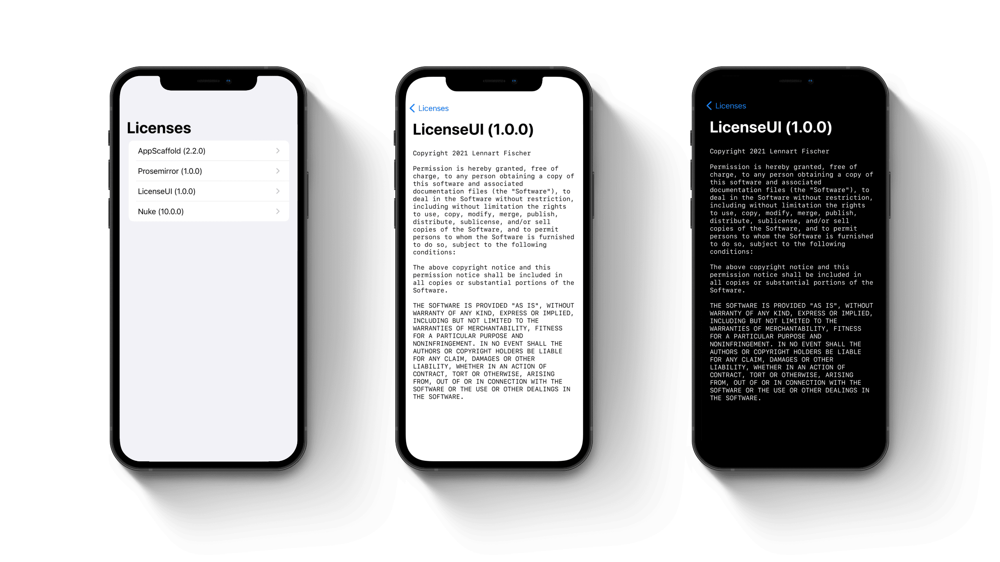

# LicenseUI

<p align="left">


</p>

This package parses your `Settings.bundle` for licenses generated with the [LicensePlist](https://github.com/mono0926/LicensePlist) package by Masayuki Ono.
You can also provide static licenses by passing `LicenseItem` to the view model or create your own `LicenseLoader` implementation.
Some of the most popular license terms can be retrieved using the `License` enum.

## Installation

Install `LicenseUI` with Swift Package Manager:

```swift
dependencies: [
    .package(name: "LicenseUI", url: "https://github.com/lambdadigamma/swift-license-ui", .upToNextMajor(from: "1.0.0")),
]
```

## Documentation

You can render the default user interface shipped with this package by using the `LicenseList` and its corresponding view model `LicensesViewModel` .
The license terms are displayed in a `LicenseDetailView`.

> Be aware that the default implementation is based on a SwiftUI `List` and needs to be embedded in a navigation context.

### Rendering a license list from settings bundle

To render licenses in your `Settings.bundle` generated with the [LicensePlist](https://github.com/mono0926/LicensePlist) package,
you can display the list like that:

```swift
LicensesList(viewModel: LicensesViewModel())
```

### Rendering a static license list or custom loader

To render a static list of licenses you can either use the `StaticLicenseLoader` or the convenience initializer: 

```swift
LicensesList(viewModel: LicensesViewModel(licenses: licenses))
```

Or use a custom loader:

```swift
LicensesList(viewModel: LicensesViewModel(loader: CustomLicenseLoader()))
```

### Rendering a custom user interface

To render a custom user interface you can still use the `LicensesViewModel` to power it.
The view model publishes the array `licenses` which you can use in your view. 
Just make sure to call `viewModel.load()` at a given time to execute the provided loader.

### Using custom license loader

Licenses are being loaded by loaders conforming to the `LicenseLoader` protocol. 
Loaders only need to implement a `load` method which returns an array of `LicenseItem`.
The default `StaticLicenseLoader` implementation looks like this:

```swift
public class StaticLicenseLoader: LicenseLoader {

    public let licenses: [LicenseItem]

    public init(licenses: [LicenseItem] = []) {
        self.licenses = licenses
    }

    public func load() -> [LicenseItem] {
        return licenses
    }

}
```

## Roadmap

- [x] Implement `Settings.bundle` parsing
- [x] Implement a static LicenseLoader
- [x] Implement rendering license list and license terms
- [x] Add the most popular licenses
- [ ] Support more localizations

## Changelog

Please see `CHANGELOG.md` for more information what has changed recently.

## Contributing

Contributions are always welcome!

## Credits

- [Lennart Fischer](https://github.com/lambdadigamma)
- [opensource.org](https://opensource.org/licenses)
- [All Contributors](https://github.com/lambdadigamma/swift-license-ui/graphs/contributors)

## License

`swift-license-ui` is available under the MIT license. See the `LICENSE.md` file for more info.
